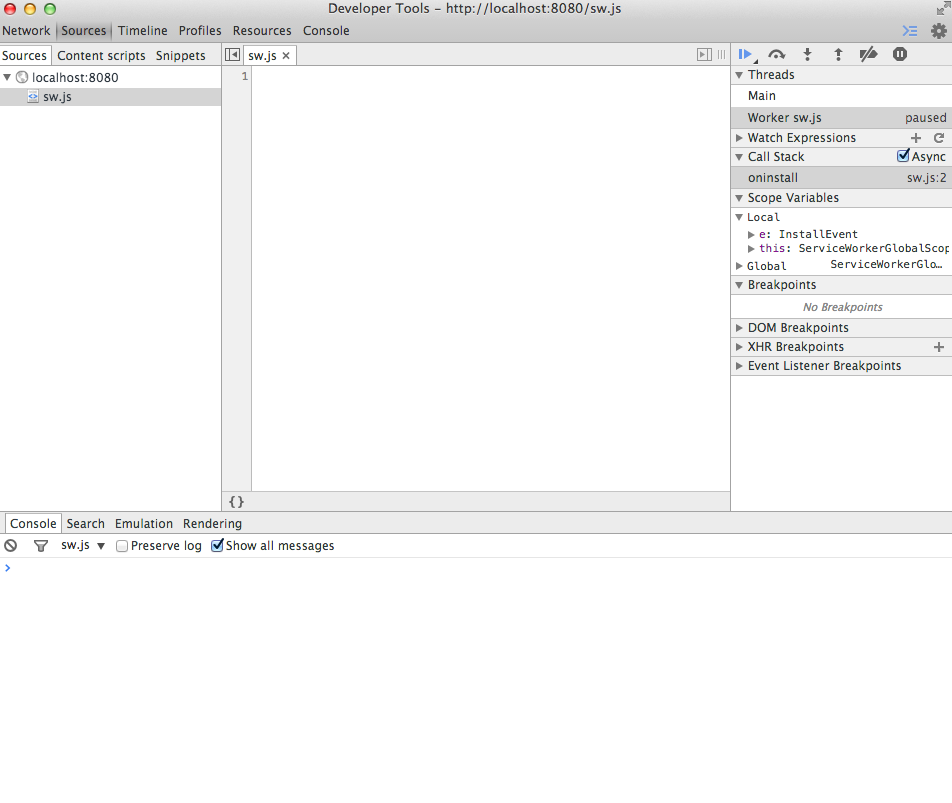

sw-issues-blank-source-on-start
===============================

- Open Chrome Canary
- Go to `chrome://serviceworker-internals`
- Check **Opens the DevTools window for ServiceWorker on start for debugging**
- Go to https://matthew-andrews.github.io/sw-issues-blank-source-on-start/index.html
- Observe Service Worker caught in breakpoint but the source tab is empty

(If you import scripts you can click to view those scripts - but not the main script itself - see https://offline-news-service-worker.herokuapp.com)



---

Sometimes the console says:-

```
Failed to load resource: net::ERR_CACHE_MISS
```

Not sure if this is related...
